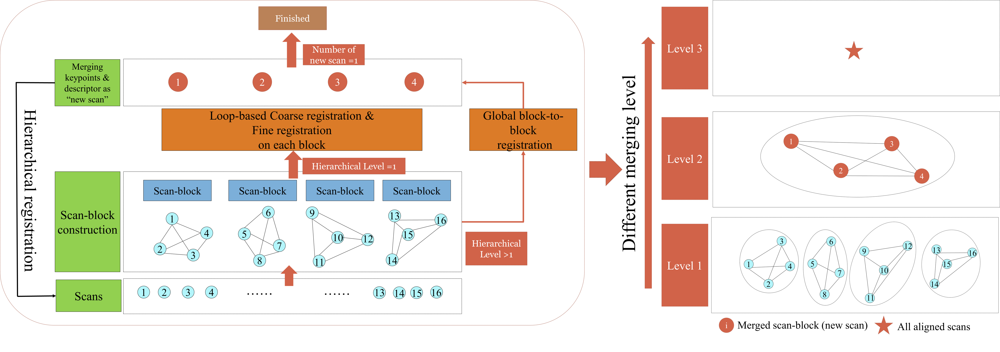
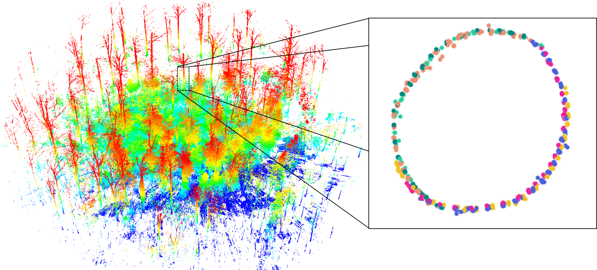
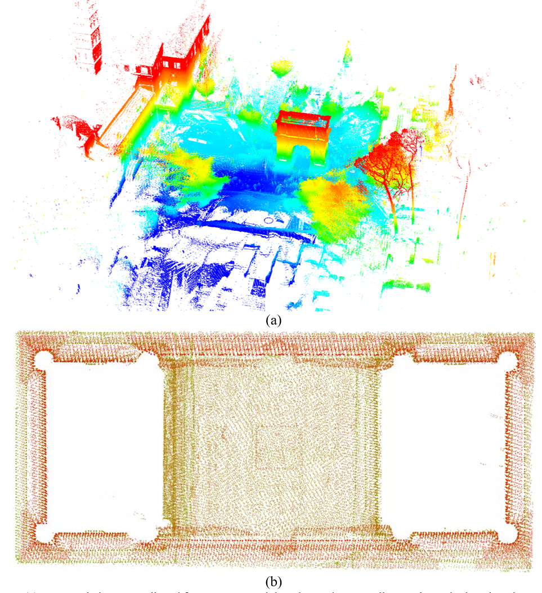
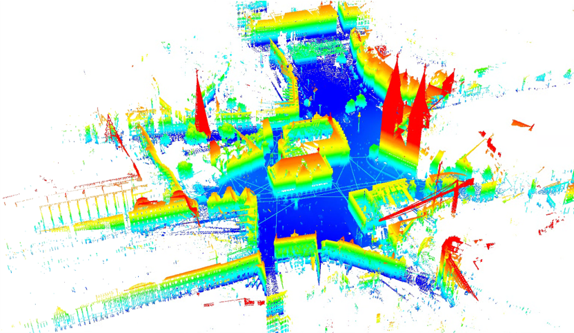
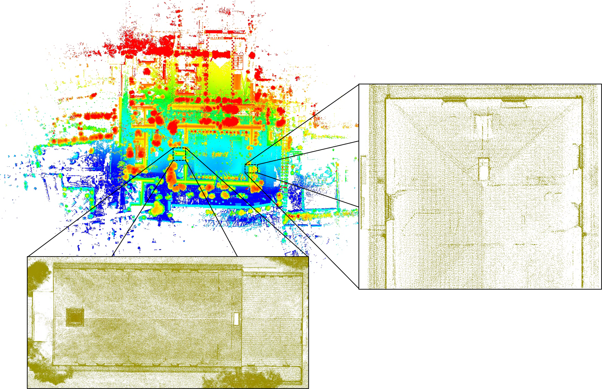
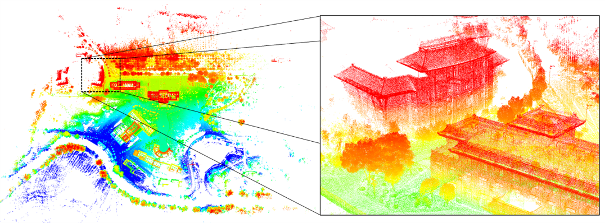
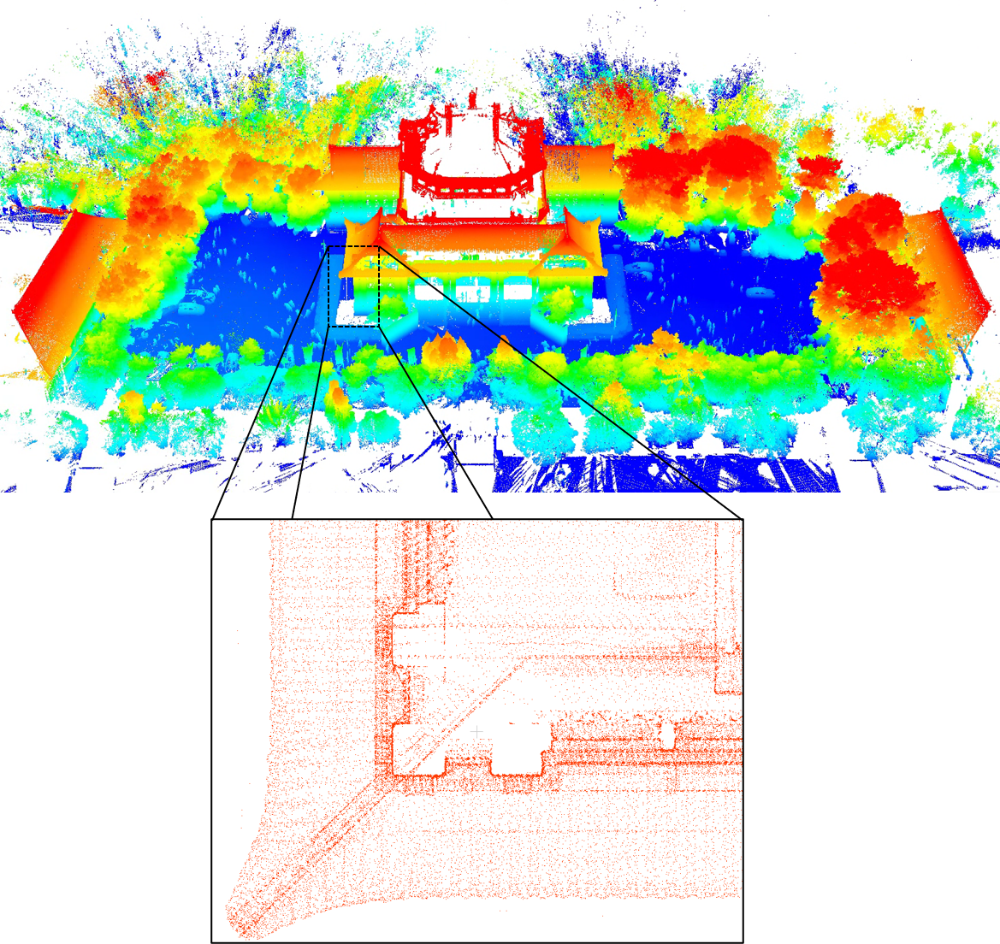

# HL-MRF
- [HL-MRF](#hl-mrf)
  - [News](#news)
  - [Hierarchical Loop-based Multiview Registration Framework](#hierarchical-loop-based-multiview-registration-framework)
  - [Demo](#demo)
    - [ETH TLS Datasets](#eth-tls-datasets)
    - [Robotic 3D Scan datasets](#robotic-3d-scan-datasets)
    - [WHU TLS datasets](#whu-tls-datasets)
  - [Paper](#paper)
  - [Contributor](#contributor)
  - [Contact](#contact)

## News
* [2022-11-8] Our paper has been accpeted by ***ISPRS*** (International Society for Photogrammetry and Remote Sensing) !
* [2022-5-27] Submit the manuscript to the journal.

We are now refactoring the code, and it will be released as soon as possible.
## Hierarchical Loop-based Multiview Registration Framework
HL-MRF can automatically perform the point-cloud-based registration for large-scale TLS scans without any artificial target. The main focus of our framework lies in the efficiency of processing large-scale TLS scans and being able to tolerate pairwise registration failure for robustness. The proposed hierarchical registration strategy and the loop-based coarse registration method deal with them respectively.

Two key features in HL-MRF are:
> * An internal scan-block and block-to-block registration strategy to hierarchically align point clouds of large-scale TLS scans.
> * A loop-based coarse registration method to remove grossly wrong pairwise registration results caused by ambiguous scanning content.

## Demo
### Pipline

### ETH TLS Datasets

### Robotic 3D Scan datasets

### WHU TLS datasets

## Paper
Publication in progress.

## Contributor
[Hao Wu (吴豪)](https://github.com/WuHao-WHU)，[Pengcheng Wei (韦朋成)](https://github.com/WPC-WHU)

## Contact 
Email: haowu2021@whu.edu.cn

Do not hesitate to contact the authors if you have any question or find any bugs.

